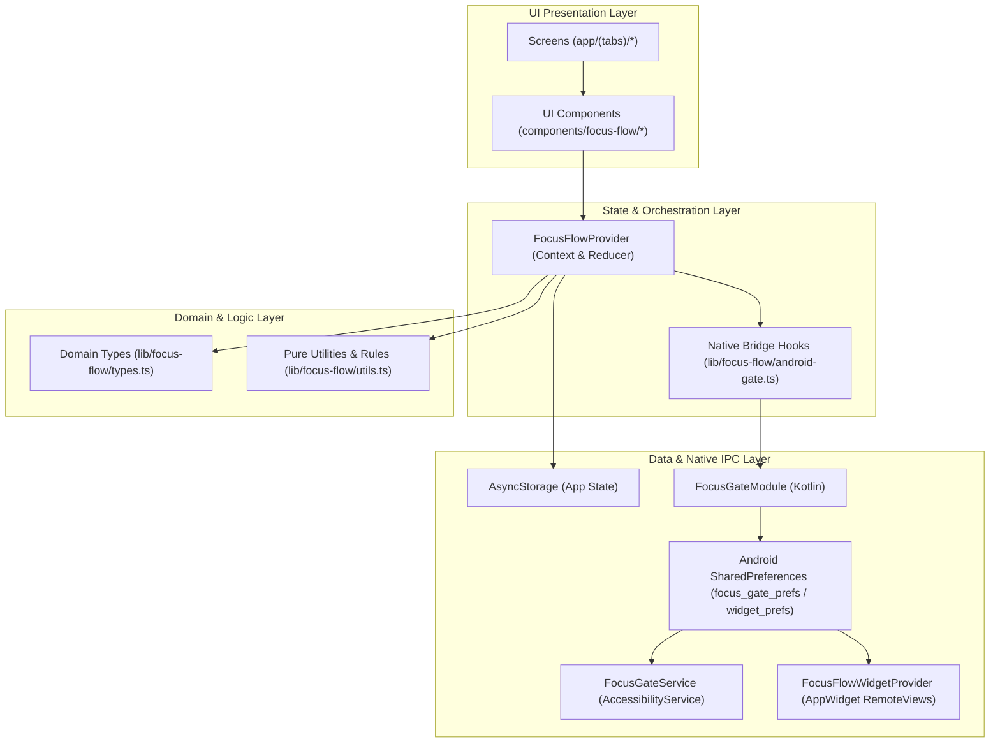
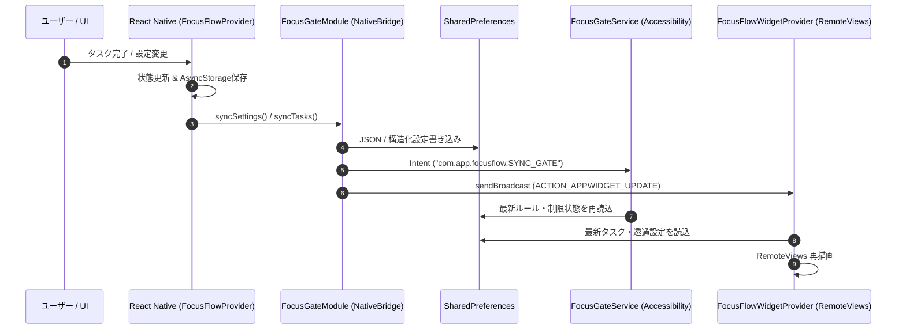
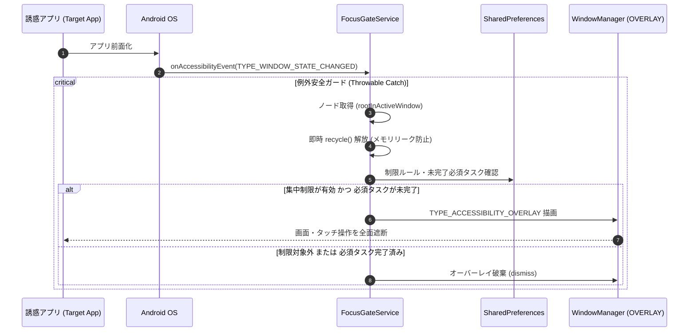

# Focus Flow アーキテクチャ設計書 (ARCHITECTURE.md)

**バージョン:** 1.0.0 (プロダクションリリース対応版)  
**更新日:** 2026年9月8日  
**技術スタック:** React Native (Expo SDK 54 / Expo Router v4), TypeScript, Android Native (Kotlin), Jetpack RemoteViews

---

## 1. 全体アーキテクチャ概要

Focus Flow は、クロスプラットフォームUI開発の生産性（React Native / Expo）と、Android OSの深層機能（アクセシビリティサービスによるアプリ遮断、ホーム画面インタラクティブWidget）をシームレスに融合したハイブリッドアーキテクチャを採用しています。

### 1.1. レイヤー構成 (Clean Architecture & UDF)

1. **Presentation Layer (`app/`, `components/focus-flow/`)**:
   * Expo Router によるファイルベースルーティング。
   * プレゼント・コンテナ分離パターンによる疎結合なUIコンポーネント群。
   * `TodoItemCard` をマスターコンポーネントとする統一デザインシステム。
2. **State & Orchestration Layer (`lib/focus-flow/provider.tsx`, `android-gate.ts`)**:
   * 単一方向データフロー（Unidirectional Data Flow: UDF）による状態管理。
   * React Context + Reducer による状態の集約。
   * TypeScriptレイヤーからNativeレイヤーへの同期オーケストレーション。
3. **Domain & Pure Logic Layer (`lib/focus-flow/types.ts`, `lib/focus-flow/utils.ts`)**:
   * 外部ライブラリ非依存の純粋な型定義とビジネスロジック。
   * 達成条件判定、ストリーク計算、サブタスク連動、時間帯検証などの純粋関数群。
   * 高いテスト容易性（Vitestによる100%自動回帰テスト担保）。
4. **Data & Native IPC Layer (`plugins/native/android/`)**:
   * React Native 側の `AsyncStorage`（メインデータ永続化）。
   * ネイティブ側の `SharedPreferences`（高速アクセス用同期キャッシュ）。
   * Android `AccessibilityService` および `AppWidgetProvider`。

---

## 2. ネイティブ統合とIPC (プロセス間通信)

アプリのJavaScriptスレッド、OSアクセシビリティサービス、およびホーム画面ウィジェットは、異なるプロセス・スレッドで並行動作します。これらは Android `SharedPreferences` および `BroadcastIntent` を介して安全にデータ同期を行います。

### 2.1. データ同期フロー

---

## 3. 集中制限サービス (`FocusGateService`)

Android の `AccessibilityService` を使用し、指定された制限対象アプリがフォアグラウンドになった際に遮断オーバーレイを描画します。

### 3.1. 遮断判定シーケンス

### 3.2. 耐障害性 & セキュリティ設計 (Production Resilience)

1. **例外安全の完全防御 (Crash Prevention)**:
   * `onAccessibilityEvent`、`onServiceConnected`、`onDestroy` を含む全コールバックを包括的な `try-catch (e: Throwable)` で保護。予期しないOSイベントやNull参照でもサービスプロセスをクラッシュさせません。
2. **AccessibilityNodeInfo メモリリーク防止**:
   * `rootInActiveWindow` や `event.source` などのノード参照を取得した場合、判定処理直後に `node.recycle()` を明示的に実行。Android バインダープールの枯渇によるサービス強制終了を防ぎます。
3. **ライフサイクル復帰 (Lifecycle Resilience)**:
   * `onInterrupt()` 発生時の安全な状態リセット。
   * 端末再起動（`BOOT_COMPLETED`）およびアプリ更新（`MY_PACKAGE_REPLACED`）時に `FocusGateBootReceiver` が自動起動し、同期状態を復元。
4. **省電力キル対策 (Battery Optimization Exemption)**:
   * `android.permission.REQUEST_IGNORE_BATTERY_OPTIMIZATIONS` を導入。
   * ユーザー向け設定画面から「電池の最適化除外」ダイアログをトリガーし、バックグラウンドでの安定稼働を確保。
5. **Google Play Prominent Disclosure (重要開示) 準拠**:
   * アクセシビリティ権限を有効化する前に、ユーザーに対して「利用目的（指定アプリの前面化検知のみ）」「収集しない情報（個人情報・入力・画面内容）」を明示したダイアログを表示。

---

## 4. ホーム画面ウィジェット (`FocusFlowWidgetProvider`)

ホーム画面からアプリを起動せずにTodoや習慣を直接確認・操作できるインタラクティブウィジェットです。

### 4.1. アーキテクチャとレンダリング仕様

1. **レスポンシブ・行数バケット (Responsive Bucketing)**:
   * ウィジェットの縦幅・横幅（`appWidgetOptions`）をリアルタイムに検知。
   * 1行（コンパクト）〜最大5行（大画面）のレイアウトを動的に選択してRemoteViewsにバインド。
2. **2層独立透過レンダリング (Dual-Layer Opacity)**:
   * **背景レイヤー (`widgetBgAlpha`):** ウィジェット外枠・ヘッダー背景。
   * **アイテム行レイヤー (`itemBgAlpha`):** 個々のタスク・習慣カード背景。
   * カラーコード（Hex ARGB）動的生成により、背景透過とコンテンツ視認性の両立を実現。
3. **リモートアクション (Interactive PendingIntents)**:
   * **Todo完了トグル:** チェックボックス押下で `ACTION_WIDGET_TOGGLE_TODO` を発行し、SharedPreferencesを直接更新後、即座にRemoteViewsを再描画。
   * **習慣カウント (+/-):** 習慣のインクリメント/デクリメントを `ACTION_WIDGET_HABIT_PLUS` / `MINUS` で処理。本文タップと独立した専用タッチターゲットを確保。
   * **習慣タイマー:** 開始/停止をウィジェット上で制御。
   * **Deep Link:** カード本文タップ時、`manusfocusflow:///todos?open=<id>` などの標準化されたURLスキームで該当タスクの詳細画面へ直接遷移。

---

## 5. Expo Config Plugin (`plugins/with-focus-flow-android.js`)

Focus Flow のネイティブコードは Expo Prebuild によって管理されています。

* **テンプレート管理:** `plugins/native/android/` に純粋なKotlinソース、XMLレイアウト、ドローアブルを配置。
* **ビルド時インジェクション:** Prebuild 実行時、`with-focus-flow-android.js` が以下を自動構成:
  * `AndroidManifest.xml` への Service / Receiver / Widget / Activity 登録。
  * 必要なパーミッション（`SYSTEM_ALERT_WINDOW`, `REQUEST_IGNORE_BATTERY_OPTIMIZATIONS`, `RECEIVE_BOOT_COMPLETED` 等）の宣言。
  * `build.gradle` への依存関係追加。
  * ネイティブソースファイルの `android/app/src/main/` 配下への自動コピー。

これにより、Clean なリポジトリ構成を維持しながら、Expo SDKのバージョンアップにも容易に追従できる保守性を確保しています。
